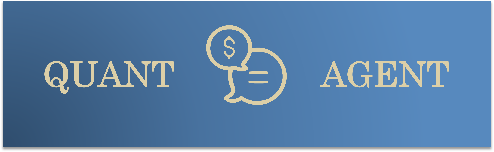
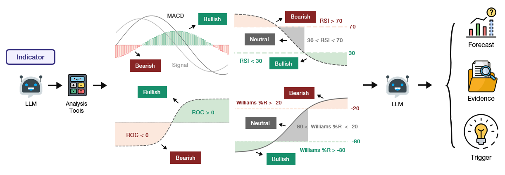
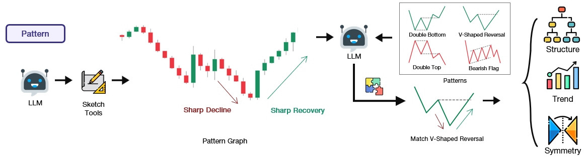
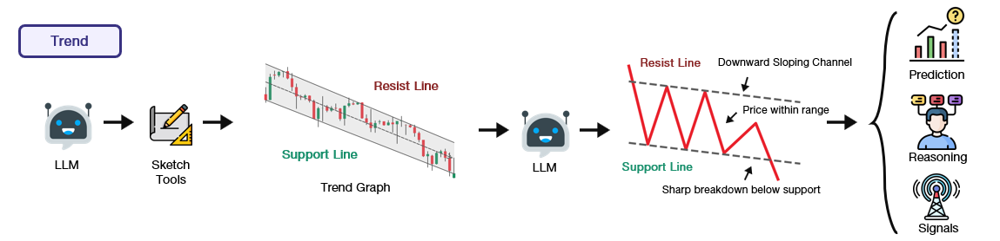
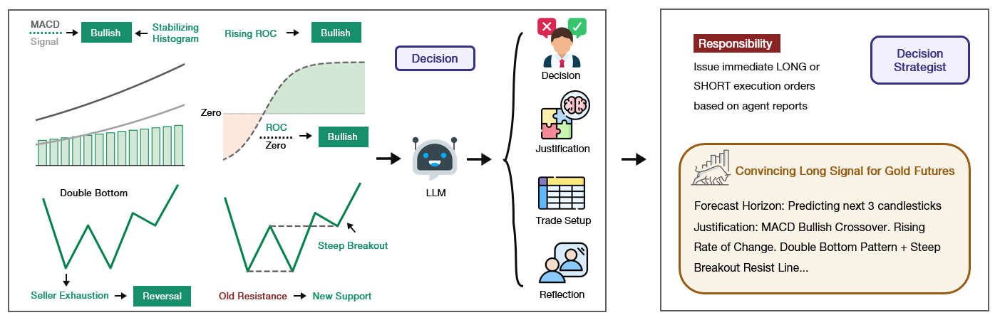
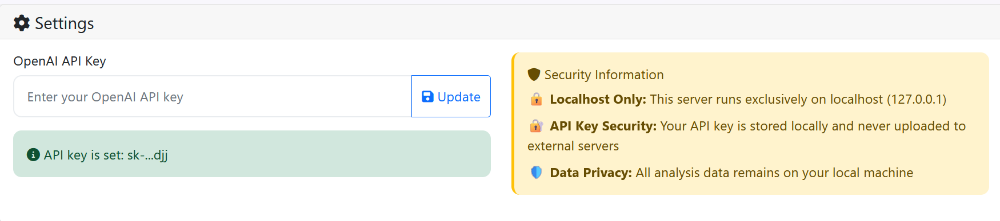

<div align="center">


<h2>QuantAgent: Price-Driven Multi-Agent LLMs for High-Frequency Trading</h2>

</div>


<div align="center">

<div style="position: relative; text-align: center; margin: 20px 0;">
  <div style="position: absolute; top: -10px; right: 20%; font-size: 1.2em;"></div>
  <p>
    <a href="https://machineily.github.io/">Fei Xiong</a><sup>1,2 ★</sup>&nbsp;
    <a href="https://wyattz23.github.io">Xiang Zhang</a><sup>3 ★</sup>&nbsp;
    <a href="https://scholar.google.com/citations?user=hFhhrmgAAAAJ&hl=en">Aosong Feng</a><sup>4</sup>&nbsp;
    <a href="https://intersun.github.io/">Siqi Sun</a><sup>5</sup>&nbsp;
    <a href="https://chenyuyou.me/">Chenyu You</a><sup>1</sup>
  </p>
  
  <p>
    <sup>1</sup> Stony Brook University &nbsp;&nbsp; 
    <sup>2</sup> Carnegie Mellon University &nbsp;&nbsp;
    <sup>3</sup> University of British Columbia &nbsp;&nbsp; <br>
    <sup>4</sup> Yale University &nbsp;&nbsp; 
    <sup>5</sup> Fudan University &nbsp;&nbsp; 
    ★ Equal Contribution <br>
  </p>
</div>

<div align="center" style="margin: 20px 0;">
  <a href="README.md">English</a> | <a href="README_CN.md">中文</a>
</div>

<br>
<p align="center">
  <a href="https://arxiv.org/abs/2509.09995">
    
  </a>
  <a href="https://Y-Research-SBU.github.io/QuantAgent">
    
  </a>
  <a href="https://github.com/Y-Research-SBU/QuantAgent/blob/main/assets/wechat_0203.jpg">
    
  </a>
  <a href="https://discord.gg/t9nQ6VXQ">
    
  </a>
</p>

</div>


A sophisticated multi-agent trading analysis system that combines technical indicators, pattern recognition, and trend analysis using LangChain and LangGraph. The system provides both a web interface and programmatic access for comprehensive market analysis.

> **About this fork (`TasS-RV/QuantAgent-Build`)** — This is a build/extension of the upstream [QuantAgent](https://github.com/Y-Research-SBU/QuantAgent) research project. On top of the original LangGraph multi-agent system, this fork adds an **AlgoEdge** pipeline: a Google Gemini–backed indicator node, a visualisation toolkit that overlays EMA + Fibonacci levels and AI-suggested buy/sell price points, and a **Telegram bot** that pushes the analysis (with the annotated chart image) straight to your phone. See [AlgoEdge Extensions](#-algoedge-extensions-this-fork) for setup.

<div align="center">

🚀 [Features](#-features) | 📲 [AlgoEdge Extensions](#-algoedge-extensions-this-fork) | 🧪 [Backtesting & Quant](#-backtesting--quant-pipelines) | ⚡ [Installation](#-installation) | 🎬 [Usage](#-usage) | 🔧 [Implementation Details](#-implementation-details) | 🤝 [Contributing](#-contributing) | 📄 [License](#-license)

</div>

## 🚀 Features

<!-- - **Multi-Agent Analysis**: Four specialized agents working together: -->
  
  ### Indicator Agent
  
  • Computes five technical indicators—including RSI to assess momentum extremes, MACD to quantify convergence–divergence dynamics, and the Stochastic Oscillator to measure closing prices against recent trading ranges—on each incoming K‑line, converting raw OHLC data into precise, signal-ready metrics.

  
  
 ### Pattern Agent
  
  • Upon a pattern query, the Pattern Agent first uses the agent draws the recent price chart, spots its main highs, lows, and general up‑or‑down moves, compares that shape to a set of familiar patterns, and returns a short, plain‑language description of the best match.
  
  
  
  ### Trend Agent
  
  • Leverages tool-generated annotated K‑line charts overlaid with fitted trend channels—upper and lower boundary lines tracing recent highs and lows—to quantify market direction, channel slope, and consolidation zones, then delivers a concise, professional summary of the prevailing trend.
  
  

  ### Decision Agent
  
  • Synthesizes outputs from the Indicator, Pattern, Trend, and Risk agents—including momentum metrics, detected chart formations, channel analysis, and risk–reward assessments—to formulate actionable trade directives, clearly specifying LONG or SHORT positions, recommended entry and exit points, stop‑loss thresholds, and concise rationale grounded in each agent’s findings.
  
  

### Web Interface
Modern Flask-based web application with:
  - Real-time market data from Yahoo Finance
  - Interactive asset selection (stocks, crypto, commodities, indices)
  - Multiple timeframe analysis (1m to 1d)
  - Dynamic chart generation
  - API key management

## 📲 AlgoEdge Extensions (this fork)

This fork adds a lightweight, end-to-end alerting pipeline on top of the core agents. It is independent of the Flask web interface and is driven by **Google Gemini** rather than the LangChain providers.

- **Gemini Indicator Node** (`Indicator_node.py`) — A standalone LangGraph-style node (`run_indicator_agent`) that sends a structured technical payload (EMA 9/14 momentum + Fibonacci support/resistance) to `gemini-2.5-flash` and gets back a strict-JSON trade report: trend summary, `Buy`/`Sell`/`Hold` action, suggested entry, take-profit, stop-loss, and rationale.
- **Visualisation Toolkit** (`plot_algoedge_chart`) — Renders the close price with EMA 9/14 and Fibonacci levels overlaid, and draws the AI's suggested **entry, take-profit, stop-loss, and your held price** as bold horizontal lines. Can return an in-memory image buffer (for Telegram), save a PNG locally, or pop up on screen.
- **Telegram Bot** (`Tele_bot.py`) — `send_telegram_alert` formats the report into a clean alert (🟢 BUY / 🔴 SELL / ⚪ HOLD) and pushes it to your chat, attaching the annotated chart as a photo.

A sample of the generated chart is committed at the repo root: `NVDA_AlgoEdge_Analysis.png`.

> **Setup for these features is described in the [Installation](#-installation) section below** (Gemini API key file + `telegram_keys.json`), and how to run it is under [Usage → AlgoEdge pipeline](#run-the-algoedge-pipeline).

## 📦 Installation

### 1. Create and Activate Conda Environment

```bash
conda create -n quantagents python=3.11
conda activate quantagents
```

### 2. Install Dependencies

```bash
pip install -r requirements.txt
```

If you encounter issues with TA-lib-python, 
try

```bash
conda install -c conda-forge ta-lib
```

Or visit the [TA-Lib Python repository](https://github.com/ta-lib/ta-lib-python) for detailed installation instructions.

### 3. Set Up LLM API Key
You can set it in our Web InterFace Later,



Or set it as an environment variable:
```bash
# For OpenAI
export OPENAI_API_KEY="your_openai_api_key_here"

# For Anthropic (Claude)
export ANTHROPIC_API_KEY="your_anthropic_api_key_here"

# For Qwen (DashScope, based in Singapore — delays may occur)
export DASHSCOPE_API_KEY="your_dashscope_api_key_here"

# For MiniMax (204K context, OpenAI-compatible API)
export MINIMAX_API_KEY="your_minimax_api_key_here"

```

### 4. Set Up AlgoEdge Credentials (for the Gemini + Telegram pipeline)

The AlgoEdge pipeline reads its secrets from **one folder above the repository** so they never get committed to git. From inside the repo, that means the files live in the *parent* directory.

**a) Google Gemini API key** — used by `Indicator_node.py` via `API_client.py`. Create a [Google AI Studio key](https://aistudio.google.com/apikey) and save it as plain text:

```bash
# Run from the repository root — writes the file one level up
echo "your_gemini_api_key_here" > ../Gemini_API.txt
```

**b) Telegram bot credentials** — used by `Tele_bot.py` to push alerts. Create a bot with [@BotFather](https://t.me/BotFather) to get a token, and get your chat ID (e.g. from [@userinfobot](https://t.me/userinfobot)). Save them as JSON:

```bash
cat > ../telegram_keys.json <<'EOF'
{
  "bot_token": "123456:ABC-your-bot-token",
  "chat_id": "your_chat_id"
}
EOF
```

Your parent directory should then contain:

```
..
├── Gemini_API.txt
├── telegram_keys.json
└── QuantAgent-Build/   ← this repo
```

> **Security note:** Keeping these files outside the repo keeps secrets out of version control. Do not move them inside the repo or hard-code keys into source. If you ever do place credentials inside the working tree, add them to `.gitignore` first.


## 🚀 Usage

### Start the Web Interface

```bash
python web_interface.py
```

The web application will be available at `http://127.0.0.1:5000`

### Web Interface Features

1. **Asset Selection**: Choose from available stocks, crypto, commodities, and indices
2. **Timeframe Selection**: Analyze data from 1-minute to daily intervals
3. **Date Range**: Select custom date ranges for analysis
4. **Real-time Analysis**: Get comprehensive technical analysis with visualizations
5. **API Key Management**: Update your OpenAI API key through the interface

### Run the AlgoEdge pipeline

Once the [AlgoEdge credentials](#4-set-up-algoedge-credentials-for-the-gemini--telegram-pipeline) are in place, run the indicator node directly:

```bash
python Indicator_node.py
```

This fetches live data via yfinance, runs the Gemini indicator agent, generates the annotated chart, and pushes the alert + chart to your Telegram chat. The behaviour is controlled by the toggles in the `__main__` block at the bottom of `Indicator_node.py`:

| Variable | Default | Purpose |
|----------|---------|---------|
| `test_symbol` | `"NVDA"` | Ticker to analyse |
| `test_duration` | `"6mo"` | History window passed to yfinance |
| `timeframe` | `"1d"` | Candle interval |
| `user_entry` | `220.50` | Your held entry price (drawn on the chart) |
| `visualise_indicators` | `True` | Overlay EMA 9/14 + Fibonacci levels |
| `visualise_price_points` | `True` | Draw AI entry / take-profit / stop-loss lines |
| `return_buffer_state` | `True` | Produce an in-memory image (required to send to Telegram) |
| `send_to_tele` | `True` | Also save a local PNG and push to Telegram |

To preview the chart on screen instead of sending it, set `return_buffer_state = False` and `send_to_tele = False` so `plot_algoedge_chart` calls `plt.show()`.

## 🧪 Backtesting & Quant Pipelines

This build also integrates two complementary quantitative pipelines that were developed on separate branches and merged into the base. They live alongside the LangGraph web app and the AlgoEdge pipeline and share `default_config.py`.

### A. Quant decision pipeline (LangGraph + Gemini)

A mathematics-first extension of the original agents: the indicator and trend agents now compute deterministic numerical signals (via `talib`) that feed an agentic **quant decision node** and a portfolio-level runner.

- `master_portfolio.py` — portfolio-level analysis across a universe of tickers, with a quant decision node that curates the mathematical agent outputs into trade decisions.
- `decision_agent_quant.py` / `quant_nodes.py` — the quant decision agent and its LangGraph nodes.
- Default models are Gemini (`gemini-2.5-flash` / `gemini-2.5-flash-lite`); the Gemini key is auto-loaded from `../Gemini_API.txt` (see [step 4](#4-set-up-algoedge-credentials-for-the-gemini--telegram-pipeline)).

```bash
# Portfolio analysis (provider one of: openai, anthropic, qwen, minimax, minimax_cn, google)
python master_portfolio.py --provider google --breakdown
python master_portfolio.py --provider google --no-short --rr-target 2.0 --output results.json
```

See [`docs/QUANT_DECISION_AGENT.md`](docs/QUANT_DECISION_AGENT.md) and [`docs/LLM_CONFIG_GUIDE.md`](docs/LLM_CONFIG_GUIDE.md) for the design and for switching the LLM/provider and API key.

### B. Backtest harness (OpenAI Agents SDK + pandas-ta)

A self-contained pipeline (independent of LangChain) that uses the **OpenAI Agents SDK** and `pandas-ta` for fast historical backtesting.

- `quant_agents.py` — the agent pipeline (`run_pipeline` / `run_pipeline_async`).
- `backtest.py` — runs the pipeline across a symbol universe over historical windows.
- `run_single.py` — one-shot analysis of a single symbol.
- `indicators.py`, `charts.py`, `visualize.py` — supporting indicators and plotting.

```bash
# Single symbol
python run_single.py --symbol NVDA --period 6mo --interval 1d

# Universe backtest (defaults to top-10 US tickers, 5y, weekly cadence)
python backtest.py --symbols NVDA AAPL MSFT --period 5y --cadence W-FRI --concurrency 4 --out backtest_results
```

**Deterministic engine + risk overlays (`backtest_engine.py`).** Signal generation
(the expensive, non-deterministic LLM step) is now separated from trade simulation
(pure, reproducible math). The engine implements the [Backtest Improvement
Roadmap](docs/BACKTEST_IMPROVEMENT_ROADMAP.md): **HOLD** as cash, a **200-day SMA
trend filter** (never short an uptrend / long a downtrend), a **confidence gate**,
**trading costs** (commission + slippage per side, short borrow), and **ATR
stop/target exits** (target = `risk_reward_ratio` × stop distance). It also runs
**trivial baselines** — buy & hold, always-long, 200dma trend-follower, seeded
random — and prints a pass/fail verdict vs the 200dma baseline.

```bash
# Tune overlays and add an out-of-sample window
python backtest.py --symbols NVDA AAPL --cadence W-FRI \
    --confidence-gate 0.75 --atr-mult 1.5 --commission 0.0002 --slippage 0.0005 \
    --oos-start 2025-01-01            # also reports OOS metrics
python backtest.py --no-trend-filter --no-stops --no-short   # ablations
```

Outputs: `summary.csv`, `baselines.csv`, per-symbol `*_trades.csv`, and
`all_signals.json` (consumed by the validator below).

> ⚠️ **Model config for this stack.** `quant_agents.py` reads `agent_llm_model` / `vision_llm_model` / `decision_llm_model` as **OpenAI** model names, but the repo-wide default of `agent_llm_model` is a Gemini model (the fork's primary pipeline). To run the backtest stack, set an OpenAI key and override the model, e.g.:
> ```bash
> export OPENAI_API_KEY="sk-..."
> export LLM_PROVIDER=openai
> export AGENT_LLM_MODEL=gpt-4o-mini   # also VISION_LLM_MODEL / DECISION_LLM_MODEL if desired
> ```
> Or pass a config dict to `run_pipeline(...)`. Optionally put these in a `.env` file (auto-loaded — see `.env.example`).

See [`IMPROVEMENTS.md`](IMPROVEMENTS.md), [`docs/PIPELINE_COMPARISON.md`](docs/PIPELINE_COMPARISON.md), and the backtest docs under [`docs/`](docs/) for details.

### C. VectorBT validation (`validate_vectorbt.py`)

Independently validates the backtest/decision signals with **VectorBT**. It reads
`all_signals.json` (or a `master_portfolio --output` file), converts the dated
directional signals into a long/short position series, and evaluates it with
`vbt.Portfolio.from_signals` (fees + slippage). If VectorBT isn't installed it
falls back to the deterministic engine, so it always runs.

```bash
python validate_vectorbt.py --signals backtest_results/all_signals.json \
    --history-dir backtest_results --fees 0.0007
```

### D. Scheduled portfolio analysis → Telegram (`portfolio_scheduler.py`)

Pulls your holdings (Trading 212 portfolio, a watchlist, or a built-in mock),
fetches recent OHLC, runs the **free, deterministic** quant decision per holding
(`quant_signal.py` — no LLM, so it's repeatable and costs nothing), and pushes a
consolidated BUY/SELL/HOLD message to Telegram every interval.

```bash
python portfolio_scheduler.py --source mock --once --no-telegram      # keyless dry run
python portfolio_scheduler.py --source watchlist --symbols AAPL NVDA --interval 3600
python portfolio_scheduler.py --source t212 --once                    # live Trading 212 portfolio
python portfolio_scheduler.py --source t212 --sentiment-weight 0.2    # blend in news sentiment (§E)
```

> **Trading 212 key.** Save your API key (Settings → API in the T212 app) as
> `../trading212_key.txt` (one folder above the repo, like the other secrets), or
> set `TRADING212_API_KEY`. Add `TRADING212_DEMO=1` for the practice account.
>
> **ETF caveat (issue #3).** Trading 212 returns an ETF as a single position, so
> the pipeline analyses the ETF's *own* price series — not its underlying
> constituents. ETF lines in the Telegram message are tagged accordingly.

### E. FinBERT news sentiment (`sentiment_agent.py`) — optional

An optional overlay using **ProsusAI/finbert** that scores recent headlines into a
sentiment signal ∈ [-1, 1] and blends it into the decision's combined signal,
re-deriving BUY/HOLD/SELL/SHORT (adjusting the decision-agent output, issue #5).
Enable it on the scheduler with `--sentiment-weight 0.2`. Requires `transformers`
+ `torch` (optional, commented in `requirements.txt`); if absent, the overlay is a
no-op and decisions are unchanged.

## 📺 Demo


## 🔧 Implementation Details


**Important Note**: Our model requires an LLM that can take images as input, as our agents generate and analyze visual charts for pattern recognition and trend analysis.

### Python Usage

To use QuantAgents inside your code, you can import the trading_graph module and initialize a TradingGraph() object. The .invoke() function will return a comprehensive analysis. You can run web_interface.py, here's also a quick example:

```python
from trading_graph import TradingGraph

# Initialize the trading graph
trading_graph = TradingGraph()

# Create initial state with your data
initial_state = {
    "kline_data": your_dataframe_dict,
    "analysis_results": None,
    "messages": [],
    "time_frame": "4hour",
    "stock_name": "BTC"
}

# Run the analysis
final_state = trading_graph.graph.invoke(initial_state)

# Access results
print(final_state.get("final_trade_decision"))
print(final_state.get("indicator_report"))
print(final_state.get("pattern_report"))
print(final_state.get("trend_report"))
```

You can also adjust the default configuration to set your own choice of LLMs or analysis parameters in web_interface.py.

```python
if provider == "anthropic":
    # Set default Claude models if not already set to Anthropic models
    if not analyzer.config["agent_llm_model"].startswith("claude"):
        analyzer.config["agent_llm_model"] = "claude-haiku-4-5-20251001"
    if not analyzer.config["graph_llm_model"].startswith("claude"):
        analyzer.config["graph_llm_model"] = "claude-haiku-4-5-20251001"

elif provider == "qwen":
    # Set default Qwen models if not already set to Qwen models
    if not analyzer.config["agent_llm_model"].startswith("qwen"):
        analyzer.config["agent_llm_model"] = "qwen3-max"
    if not analyzer.config["graph_llm_model"].startswith("qwen"):
        analyzer.config["graph_llm_model"] = "qwen3-vl-plus"

elif provider == "minimax":
    # Set default MiniMax models (204K context window)
    if not analyzer.config["agent_llm_model"].startswith("MiniMax"):
        analyzer.config["agent_llm_model"] = "MiniMax-M2.7"
    if not analyzer.config["graph_llm_model"].startswith("MiniMax"):
        analyzer.config["graph_llm_model"] = "MiniMax-M2.7"

else:
    # Set default OpenAI models if not already set to OpenAI models
    if analyzer.config["agent_llm_model"].startswith(("claude", "qwen", "MiniMax")):
        analyzer.config["agent_llm_model"] = "gpt-4o-mini"
    if analyzer.config["graph_llm_model"].startswith(("claude", "qwen", "MiniMax")):
        analyzer.config["graph_llm_model"] = "gpt-4o"

```

For live data, we recommend using the web interface as it provides access to real-time market data through yfinance. The system automatically fetches the most recent 30 candlesticks for optimal LLM analysis accuracy.

### Configuration Options

The system supports the following configuration parameters:

- `agent_llm_model`: Model for individual agents (default: "gpt-4o-mini")
- `graph_llm_model`: Model for graph logic and decision making (default: "gpt-4o")
- `agent_llm_temperature`: Temperature for agent responses (default: 0.1)
- `graph_llm_temperature`: Temperature for graph logic (default: 0.1)

**Note**: The system uses default token limits for comprehensive analysis. No artificial token restrictions are applied.

You can view the full list of configurations in `default_config.py`.

## 🤝 Contributing

1. Fork the repository
2. Create a feature branch
3. Make your changes
4. Add tests if applicable
5. Submit a pull request

## 📄 License

This project is licensed under the MIT License - see the LICENSE file for details.

## 🔖 Citation
```
@article{xiong2025quantagent,
  title={QuantAgent: Price-Driven Multi-Agent LLMs for High-Frequency Trading},
  author={Fei Xiong and Xiang Zhang and Aosong Feng and Siqi Sun and Chenyu You},
  journal={arXiv preprint arXiv:2509.09995},
  year={2025}
}
```


## 🙏 Acknowledgements

This repository was built with the help of the following libraries and frameworks:

- [**LangGraph**](https://github.com/langchain-ai/langgraph)
- [**OpenAI**](https://github.com/openai/openai-python)
- [**Anthropic (Claude)**](https://github.com/anthropics/anthropic-sdk-python)
- [**Google Gemini**](https://github.com/googleapis/python-genai) — powers the AlgoEdge indicator node
- [**Telegram Bot API**](https://core.telegram.org/bots/api) — alert delivery
- [**Qwen**](https://github.com/QwenLM/Qwen)
- [**MiniMax**](https://platform.minimaxi.com/) — 204K context, OpenAI-compatible API
- [**yfinance**](https://github.com/ranaroussi/yfinance)
- [**Flask**](https://github.com/pallets/flask)
- [**TechnicalAnalysisAutomation**](https://github.com/neurotrader888/TechnicalAnalysisAutomation/tree/main)
- [**tvdatafeed**](https://github.com/rongardF/tvdatafeed)
## ⚠️ Disclaimer

This software is for educational and research purposes only. It is not intended to provide financial advice. Always do your own research and consider consulting with a financial advisor before making investment decisions.

## 🐛 Troubleshooting

### Common Issues

1. **TA-Lib Installation**: If you encounter TA-Lib installation issues, refer to the [official repository](https://github.com/ta-lib/ta-lib-python) for platform-specific instructions.

2. **LLM API Key**: Ensure your API key is properly set in the environment or through the web interface.

3. **Data Fetching**: The system uses Yahoo Finance for data. Some symbols might not be available or have limited historical data.

4. **Memory Issues**: For large datasets, consider reducing the analysis window or using a smaller timeframe.

### Support

If you encounter any issues, please:

0. Try refresh and re-enter LLM API key
1. Check the troubleshooting section above
2. Review the error messages in the console
3. Ensure all dependencies are properly installed
4. Verify your API key is valid and has sufficient credits

## 📧 Contact

For questions, feedback, or collaboration opportunities, please contact:

**Email**: [chenyu.you@stonybrook.edu](mailto:chenyu.you@stonybrook.edu), [siqisun@fudan.edu.cn](mailto:siqisun@fudan.edu.cn)


## Star History

[](https://www.star-history.com/#Y-Research-SBU/QuantAgent&Date)
